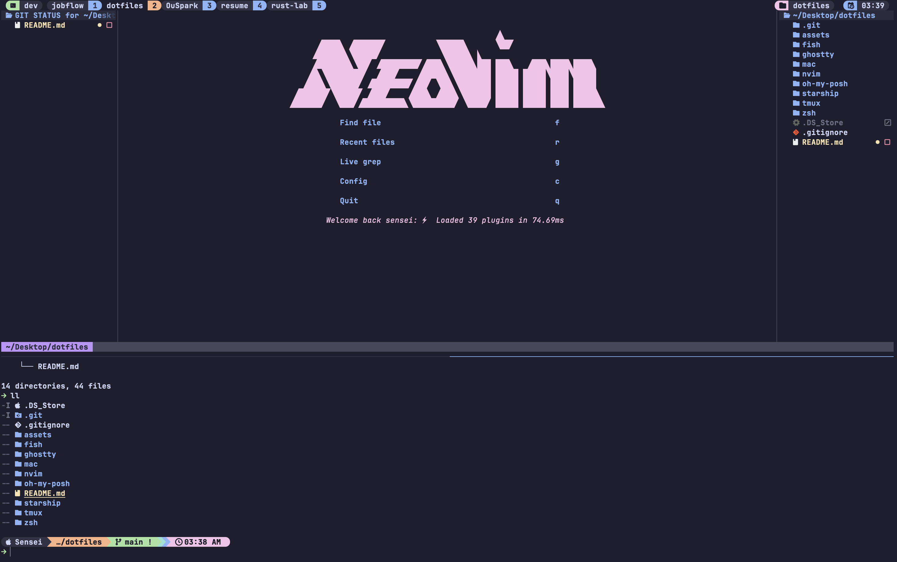

# My Dotfiles 🚀

A curated collection of configuration files and setup scripts for a modern development environment with Fish shell, Neovim, Tmux, and more.

## 🎨 Screenshot



## 📦 Components

### [Fish Shell](./fish/)
Modern command-line shell with smart autosuggestions, vi-mode keybindings, and Starship prompt integration.

### [Neovim](./nvim/)
Highly customized Neovim setup with LSP support, fuzzy finding, autocompletion, and modern UI enhancements for an IDE-like experience.

### [Tmux](./tmux/)
Terminal multiplexer configuration with vim-style navigation, session management, catppuccin theme, and productivity-focused plugins.

### [Starship](./starship/)
Fast, minimal, and customizable cross-shell prompt with git integration and project-aware indicators.

### [Ghostty Terminal](./ghostty/)
Modern GPU-accelerated terminal emulator with excellent performance and customization options.

### [Oh My Posh](./oh-my-posh/)
Cross-platform prompt theme engine with beautiful themes and extensive customization (alternative to Starship).

### [macOS Setup Script](./mac/)  
A comprehensive automated setup script for configuring a complete macOS development environment, including terminal, shell, themes, and essential tools.

### [Zsh Configuration](./zsh/)
Custom `.zshrc` file containing shell settings, plugins, and theme configuration for an optimized terminal experience.

## ⚡ Quick Start

1. **Clone this repository**
   ```bash
   git clone https://github.com/AyanQuadri/dotfiles.git ~/dotfiles
   cd ~/dotfiles
   ```

2. **Install Homebrew** (if not already installed)
   ```bash
   /bin/bash -c "$(curl -fsSL https://raw.githubusercontent.com/Homebrew/install/HEAD/install.sh)"
   ```

3. **Setup each component**
   - Follow the [Fish Shell setup guide](./fish/README.md)
   - Follow the [Neovim setup guide](./nvim/README.md)
   - Follow the [Tmux setup guide](./tmux/README.md)
   - Follow the [Starship setup guide](./starship/)
   - Follow the [Ghostty setup guide](./ghostty/README.md)
   - Follow the [Oh My Posh setup guide](./oh-my-posh/README.md)
   - Follow the [macOS setup guide](./mac/README.md)
   - Apply the [Zsh Configuration](./zsh/README.md)

## 🎯 Recommended Setup Order

For the best experience, set up components in this order:

1. **Terminal**: Ghostty (or your preferred terminal)
2. **Shell**: Fish or Zsh
3. **Prompt**: Starship or Oh My Posh
4. **Multiplexer**: Tmux
5. **Editor**: Neovim
6. **Automation**: macOS setup script (optional, for fresh installs)

## 📋 Prerequisites

- macOS (tested on macOS 11+) or Linux
- [Homebrew](https://brew.sh/) package manager (macOS)
- A [Nerd Font](https://www.nerdfonts.com/) for proper icon display
- Git

## ✨ Key Features

- **Modern Shell Experience**: Fish shell with intelligent autosuggestions and vi-mode
- **Powerful Editor**: Neovim with LSP, autocompletion, and fuzzy finding
- **Session Management**: Tmux with vim-style keybindings and plugin ecosystem
- **Beautiful Prompts**: Starship or Oh My Posh for customizable, fast prompts
- **Consistent Theming**: Catppuccin colorscheme across all tools
- **Productivity Focused**: Optimized keybindings and workflows

## 🛠️ Tech Stack

- **Shell**: Fish Shell / Zsh
- **Editor**: Neovim (0.11+)
- **Terminal**: Ghostty
- **Multiplexer**: Tmux
- **Prompt**: Starship / Oh My Posh
- **Package Manager**: Homebrew, Lazy.nvim, TPM
- **Fuzzy Finder**: fzf, Telescope
- **File Manager**: eza, Neo-tree, mini.files

## 🔧 Maintenance

Each component includes its own README with specific installation, configuration, and maintenance instructions. Check the individual directories for detailed guides.

### Updating Plugins

**Fish plugins:**
```bash
fisher update
```

**Neovim plugins:**
```vim
:Lazy sync
```

**Tmux plugins:**
```
prefix + U  (Ctrl+a then Shift+u)
```
